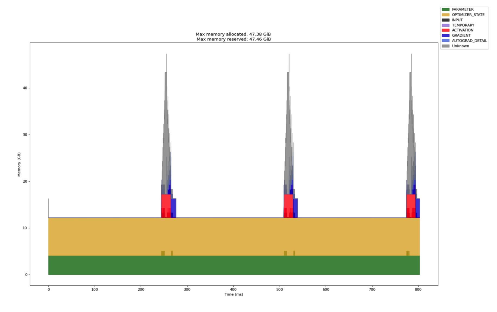
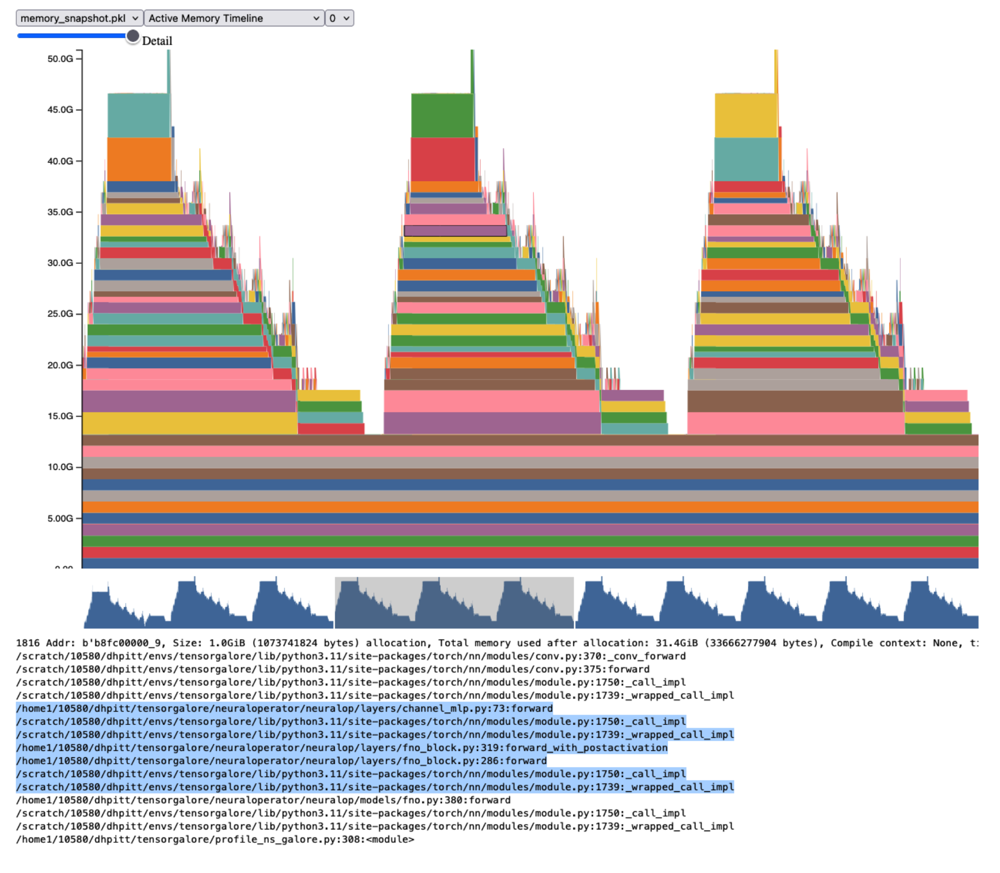

# Memory Profiling and Timing in PyTorch

This guide explains how to profile memory and timing during model training in PyTorch using a dual profiler approach. We introduce a new memory profiling method built on top of PyTorch's native profiler utilities, which enables fine-grained breakdowns of memory usage by category, including an estimate of intermediate and uncategorized memory.

## Overview

PyTorch provides built-in tools to trace memory allocations and execution timing via `torch.profiler`. However, raw outputs can be noisy, and certain memory blocks—especially those with short lifetimes—are often not properly categorized. Our profiling strategy combines:

1. **Timeline-based memory categorization** using PyTorch's internal `MemoryProfileTimeline`
2. **Custom analysis** via the `TimelineTracer` class to compute averaged breakdowns of memory usage over multiple training steps
3. **Memory snapshots** to inspect uncategorized (`None`) memory blocks and link them to stack traces

## Quick Start

First set up your environment using [uv](https://github.com/astral-sh/uv):
Then run:
```
uv venv
uv sync
source .venv/bin/activate
```

To quickly profile a small FNO model, run:

```
python main.py \
--batch-size 8 \
--in-channels 3 \
--out-channels 1 \
--hidden-channels 64 \
--data-size 64 \
--device cuda:0 \
--save-dir ./profiler_outputs
```

## Diagnosing "None"-Tagged Memory

PyTorch's profiler occasionally fails to categorize memory blocks upon allocation. These appear under a "None" category in the memory timeline. These steps outline a procedure for identifying the source of a section of memory tagged as "None".

### Step 1: Use Memory Timeline

The `MemoryProfileTimeline` reports memory usage over time per category. "None" blocks often dominate the total memory at peak usage. These may be:

- Intermediate activations
- Temporary buffers not yet tagged
- Allocations that are reclassified later



*Figure: An example memory timeline obtained using `torch.profiler.profile`. The profiler was run for three iterations, which each consist of a model's forward pass, loss backpropagation and optimizer step. Notice the large grey spikes of memory tagged "Unknown".*

### Step 2: Use Memory Snapshot

PyTorch also provides a full CUDA memory snapshot with more granular information that you can use in concert with the above timeline to get a more detailed perspective on memory usage.

To investigate further, use:

```python
torch.cuda.memory._record_memory_history(max_entries=1000000)
# ... place code here for a few iterations of the operation you want to profile
# dump the memory snapshot to an output file
snapshot = torch.cuda.memory._snapshot()
dump(snapshot, open("memory_snapshot.pkl", "wb"))
```

This captures each memory block, including:
- Size and location
- Allocation stack trace
- Lifetime and category (if known)

### Step 3: Visualize

Load the saved output file into PyTorch's memory visualizer, which is found at https://pytorch.org/memory_viz. The website allows you to inspect the snapshot interactively.

By mousing over a block of memory, you can inspect information about its size, lifetime, and the stack trace (e.g., lines of code) that were run to allocate the memory. This will often point to a location in your model's forward call, or that of a submodule, which will tell you to which operation this memory corresponds.



*Figure: The same three iterations from above visualized in a CUDA memory snapshot. The highlighted purple block is paired with a full stack trace, printed out below the snapshot. In this case, the purple memory block corresponds to an intermediate activation from a ChannelMLP layer called during our FNO model's forward pass.*

### Step 4: Interpret Combined

Cross-reference the memory timeline and snapshot:
1. Match timestamps of peak "None" memory
2. Inspect corresponding blocks in snapshot
3. Use stack traces to trace back to source ops

In practice, most "None" memory blocks fall into intermediate activations or temporary buffers, hence we roll them into a derived `INTERMEDIATE` category.

## Profiling Setup

In this example, we perform profiling during a representative segment of training using a fixed schedule:

```python
N_WAIT_STEPS = 1
N_WARMUP_STEPS = 1
N_ACTIVE_STEPS = 3
N_REPEATS = 2
```

This means that each profiling session includes:
- 1 discarded warmup step
- 1 warmup step
- 3 profiled steps
- Repeated 2 times

One additional step is included to avoid timeout issues, giving a total of `NUM_BATCHES = 9`.

## TimelineTracer: Custom Memory Trace Handler

We define a custom trace handler class called `TimelineTracer`, which coalesces and summarizes memory usage during the profiled steps:

```python
class TimelineTracer(object):
    def __init__(self, out_file):
        super().__init__()
        self.out_file = out_file
        self._totals = {c: 0. for c in categories.keys()}
        self._totals["INTERMEDIATE"] = 0.
        self.steps = 0

    def __call__(self, prof):
        self.steps += 1
        # export raw memory timeline
        mem_tl = MemoryProfileTimeline(prof._memory_profile())
        times, sizes = mem_tl._coalesce_timeline(device_str)
        times = np.array(times)
        sizes = np.array(sizes)
        
        t_min = min(times)
        times -= t_min
        device = torch.device(device_str)

        msg = f"Memory Breakdown at Peak for {device_str}\n---------\n"
        
        # Compute totals, find peak usage, collect values
        true_totals = np.sum(sizes, axis=1)
        true_peak_mem_ts = np.argmax(true_totals)
        true_peak_mem = true_totals[true_peak_mem_ts] / GB
        
        breakdown_totals = np.sum(sizes[:,:8], axis=1)
        breakdown_peak_mem_ts = np.argmax(breakdown_totals)
        breakdown_peak_mem = breakdown_totals[breakdown_peak_mem_ts] / GB

        for key, idx in categories.items():
            key_peak_mem = sizes[breakdown_peak_mem_ts, idx+1]
            self._totals[key] += key_peak_mem
            msg += f"Max {key} (GB): {(self._totals[key] / self.steps) / GB :.2f}\n"
        
        intermediate_mem = true_peak_mem - breakdown_peak_mem
        self._totals["INTERMEDIATE"] += intermediate_mem
        intermed_total = self._totals["INTERMEDIATE"]
        
        msg += f"Max INTERMEDIATE (GB): {(intermed_total / self.steps) / GB :.2f}\n"
        msg += f"Peak total memory (GB): {true_peak_mem:.2f}\n"
        
        with open(self.out_file, "w") as f:
            f.write(msg)
        f.close()
```

### Breakdown Logic

At each `on_trace_ready` callback, we extract the memory timeline via `MemoryProfileTimeline`. We compute memory usage over time and identify:

- `true_peak_mem_ts`: the timestamp with the maximum total memory
- `breakdown_peak_mem_ts`: the timestamp with the highest memory excluding the "None" category

We calculate:
- Category-specific memory usage (e.g., parameters, activations, gradients)
- Intermediate memory as: `intermediate = total at true_peak - total at breakdown_peak`

This logic allows us to capture untagged intermediate tensors that are either short-lived or lazily tagged.

## Output Example

At the end of profiling, the script writes a summary like:

```
Memory Breakdown at Peak for cuda:0
---------
Max PARAMETER (GB): 1.23
Max OPT (GB): 0.45
Max INPUT (GB): 0.00
Max TEMP (GB): 0.34
Max ACTIVATION (GB): 0.98
Max GRADS (GB): 1.12
Max AUTOGRAD_DETAIL (GB): 0.29
Max INTERMEDIATE (GB): 2.34
Peak total memory (GB): 6.75
```

This output is averaged across profiling steps and written to `max_mem.txt`.

## Memory Categories

We classify memory into the following categories:

| Category | Description |
|----------|-------------|
| PARAMETER | Model weights (`torch.nn.Parameter`) |
| OPT | Optimizer states, such as moment estimates for Adam |
| INPUT | Input and preprocessed tensors |
| ACTIVATION | Activations created during the forward pass |
| GRADS | Gradients accumulated during backpropagation |
| TEMP | Temporary buffers used in complex operations (e.g., FFTs) |
| AUTOGRAD_DETAIL | Graph and intermediate buffers used by PyTorch's autograd engine |
| INTERMEDIATE | Uncategorized or transient memory (derived from None blocks) |

## Using the Profiler

Here's a minimal example for running the profiler with `TimelineTracer`:

```python
with torch.profiler.profile(
    activities=[
        torch.profiler.ProfilerActivity.CPU,
        torch.profiler.ProfilerActivity.CUDA
    ],
    schedule=torch.profiler.schedule(
        wait=N_WAIT_STEPS,
        warmup=N_WARMUP_STEPS,
        active=N_ACTIVE_STEPS,
        repeat=N_REPEATS
    ),
    record_shapes=True,
    profile_memory=True,
    with_stack=True,
    on_trace_ready=TimelineTracer("max_mem.txt"),
) as prof:
    for idx in range(NUM_BATCHES):
        # ... place code for your iteration here that you'd like to profile
        prof.step()

# If desired, also export:
prof.export_memory_timeline("memory_timeline.html")
```

## Implementation in main.py

The `main.py` script provides a complete implementation of this profiling approach with the following features:

### Model Setup
- Creates a small FNO (Fourier Neural Operator) model with configurable parameters
- Uses AdamW optimizer (no scheduler)
- Configurable input/output channels, hidden channels, and data size

### Profiling Configuration
- **Memory Profiling**: Records memory history and exports timeline
- **Timing Measurements**: CUDA event-based timing for forward pass, backward pass, and optimizer step
- **Memory Snapshots**: Saves detailed memory snapshots for analysis
- **Parameter Validation**: Checks for unused parameters

### Command Line Interface
All parameters are configurable via Typer CLI:

```bash
python main.py --help
```

Key parameters:
- `--batch-size`: Batch size for profiling
- `--in-channels/--out-channels`: Model input/output channels
- `--hidden-channels`: Hidden layer size
- `--data-size`: Input data dimensions
- `--device`: Target device (default: cuda:0)
- `--save-dir`: Output directory for results

### Output Files
The profiler generates several output files:
- `max_mem.txt`: Memory breakdown at peak usage
- `memory_timeline.html`: Interactive memory timeline
- `memory_snapshot.pkl`: Memory snapshot data
- `cuda_timing.txt`: CUDA timing measurements

## Summary

This profiling strategy improves upon vanilla PyTorch profiling by:

1. **Averaging memory usage** over steps to smooth out noise
2. **Identifying the true memory peak** vs. tagged peak to distinguish long-lived vs. transient allocations
3. **Reclassifying "None" memory** into a meaningful `INTERMEDIATE` category via subtraction
4. **Enabling in-depth diagnostics** using memory snapshots and stack traces

Our approach is suitable for debugging GPU memory bottlenecks, improving training efficiency, and comparing memory usage across models or configurations.

## Getting Started

1. Install dependencies:
   ```bash
   pip install -r requirements.txt
   ```

2. Run the profiler:
   ```bash
   python main.py
   ```

3. Analyze results in the `./profiler_outputs` directory

4. For detailed memory analysis, load `memory_snapshot.pkl` into PyTorch's memory visualizer at https://pytorch.org/memory_viz 